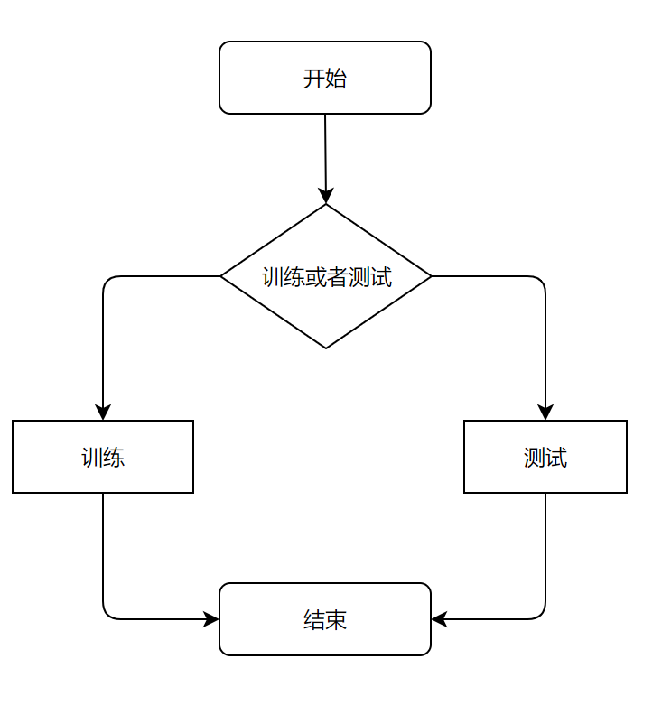
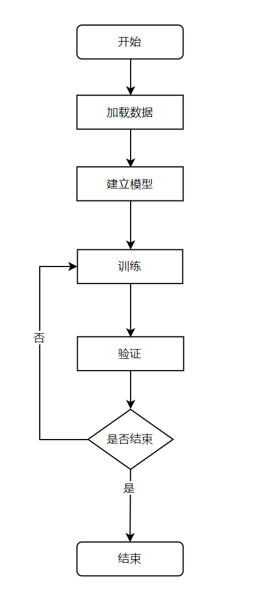
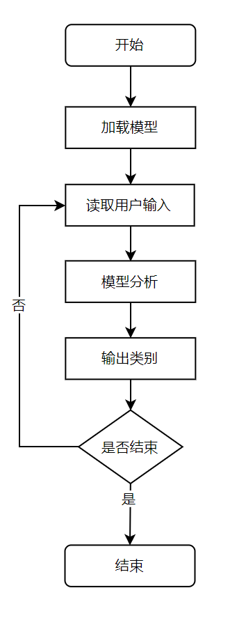

# 1.题目

中文文本分类

# 2.项目介绍

对输入文本实现分类，类别共十项：

```
体育, 财经, 房产, 家居, 教育, 科技, 时尚, 时政, 游戏, 娱乐
```

# 3.核心思想和算法描述

利用标注好的语料训练神经网络，使用训练好的神经网络对输入文本进行分类

网络模型：

```
卷积神经网络（CNN）
```

包含嵌入层，多个一维卷积层，池化层，丢弃层和全连接层

损失函数：

```
交叉熵损失函数（Cross Entropy Loss）
```

优化算法：

```
Adam优化算法
```

Adam优化算法在批量梯度下降（batch gradient descent）的基础上增加指数加权移动平均

# 4.数据集

使用THUCNews的一个子集，子集获取地址为https://github.com/gaussic/text-classification-cnn-rnn

包含四个文件：

```
cnews.vocab.txt（字典）
cnews.train.txt（训练集）
cnews.val.txt（验证集）
cnews.test.txt（测试集）
```

数据格式：

```
标签 文本
标签 文本
...
```

# 5.模块流程

系统分为三大模块：交互，训练，测试

## 5.1交互



## 5.2训练



## 5.3测试



# 6.结果分析

## 6.1训练结果

```
批量大小：256 词向量维度：50 卷积层输出通道数：30，30，30，30 卷积核宽度：1，2，3，4 迭代轮数：5 学习率：0.01
```

```
training on cuda
epoch 1, loss 0.8756, train acc 0.72, val acc 0.89, time 52.9 sec
epoch 2, loss 0.3211, train acc 0.91, val acc 0.91, time 49.3 sec
epoch 3, loss 0.2611, train acc 0.92, val acc 0.92, time 50.8 sec
epoch 4, loss 0.2429, train acc 0.93, val acc 0.90, time 52.3 sec
epoch 5, loss 0.2254, train acc 0.93, val acc 0.91, time 52.3 sec
```

经过五轮迭代后，模型在验证集上取得了0.91的准确率

## 6.2测试结果

```
输入文本：
高仓位否极泰来 中邮核心领跑基金业今年以来净值增长率达42.6%，超过沪深300指数7个百分点⊙本报记者 徐婧婧进入2009年以后，股市一改之前的颓势出现了强势上涨。截至昨日，沪深300指数今年以来已经上涨了35.45%。受此影响，各股票型基金净值快速回升，而排在股票型基金第一位的中邮核心优选基金终于否极泰来，截至昨日，该基金今年以来净值增长率已经达到了42.59%，领跑整个基金业，甚至超过了所有的指数化产品。
输出：
财经
```

```
输入文本：
麦基砍28+18+5却充满寂寞 纪录之夜他的痛阿联最懂新浪体育讯上天对每个人都是公平的，贾维尔-麦基也不例外。今天华盛顿奇才客场104-114负于金州勇士，麦基就好不容易等到“捏软柿子”的机会，上半场打出现象级表现，只可惜无法一以贯之。最终，麦基12投9中，得到生涯最高的28分，以及平生涯最佳的18个篮板，另有5次封盖。此外，他11次罚球命中10个，这两项也均为生涯最高。
输出：
体育
```

模型表现良好

# 7.程序使用

功能函数集中在TextCNN.py

程序入口main.py

执行main.py，根据命令行提示可以选择训练自己的模型或者输入文本进行分类

# 8.分工

独自完成